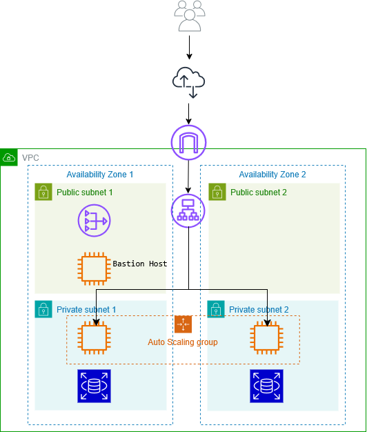

# AWS Capstone Project – Van Gogh Gallery on AWS

## Project Overview

This project implements a scalable and highly available WordPress infrastructure on AWS, provisioned using Terraform (Infrastructure as Code) and deployed via Terraform Cloud.

The application is a themed WordPress website called **"Van Gogh Gallery"**, presenting art articles and a curated gallery of Vincent van Gogh’s paintings.

The focus of this project is infrastructure architecture, security design, and high availability rather than website content.

---

## Architecture Diagram

---

## Architecture Summary

- Multi-AZ deployment (us-west-2a & us-west-2b)
- Public and Private subnet separation
- WordPress instances deployed in private subnets only
- Application Load Balancer (ALB)
- Auto Scaling Group (2–3 instances)
- Amazon RDS MySQL (private access)
- NAT Gateway for outbound traffic
- Bastion Host for secure SSH access
- Terraform Cloud for remote state management

---

## Network Design

VPC CIDR: `10.0.0.0/16`

Public Subnets:
- 10.0.1.0/24 (AZ-a)
- 10.0.3.0/24 (AZ-b)

Private Subnets:
- 10.0.2.0/24 (AZ-a)
- 10.0.4.0/24 (AZ-b)

### Traffic Flow

Internet
↓
Application Load Balancer (Public Subnets)
↓
Auto Scaling Group (Private Subnets)
↓
Amazon RDS MySQL (Private Subnets)

---

## Compute & Scaling

- Launch Template for automated WordPress installation
- Auto Scaling Group:
  - Min: 2
  - Desired: 2
  - Max: 3
- CPU-based target tracking policy
- No public IP assigned to application instances

---

## Database

- Amazon RDS MySQL 8.x
- Instance type: db.t3.micro
- Private access only
- DB Subnet Group across two AZs

---

## Security Design

- WordPress EC2 instances not publicly accessible
- Database accessible only from WordPress Security Group
- SSH access restricted to Bastion Host
- Bastion SSH restricted to personal IP
- Security Groups follow least-privilege principle
- NAT Gateway used for controlled outbound internet access

---

## Deployment Workflow

1. Terraform code stored in GitHub
2. Connected to Terraform Cloud
3. Remote state managed securely
4. Infrastructure deployed via Terraform Cloud runs

---

## Result

- Van Gogh Gallery accessible via ALB DNS
- High availability across two Availability Zones
- Fully automated and repeatable infrastructure

---

## Author

Thao Bui  
Bootcamp Capstone Project  
AWS | Terraform | Linux
