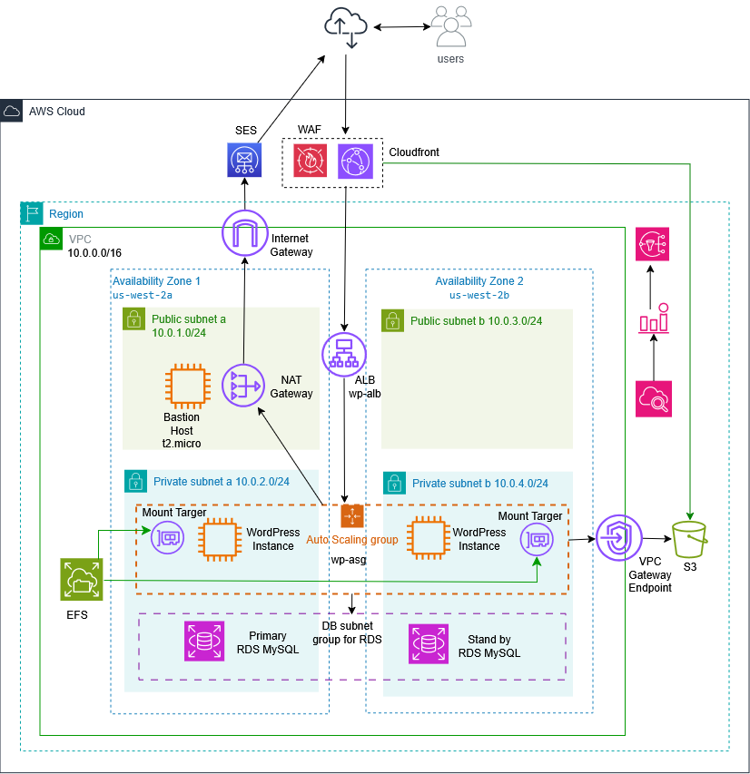

# AWS Capstone Project – Van Gogh Gallery

## Overview

This project deploys a highly available and scalable WordPress infrastructure on AWS using Terraform (Infrastructure as Code).

The application, **Van Gogh Gallery**, runs in a secure multi-tier architecture across two Availability Zones in `us-west-2`.

This implementation satisfies the **Expert Level** Capstone requirements and includes additional production-ready enhancements.

---

## Architecture



### Network
- VPC: `10.0.0.0/16`
- 2 Public Subnets (ALB, Bastion, NAT)
- 2 Private Subnets (WordPress, RDS)
- Multi-AZ deployment (us-west-2a, us-west-2b)

### Traffic Flow

Internet  
→ CloudFront  
→ Application Load Balancer  
→ Auto Scaling Group (WordPress – Private Subnets)  
→ Amazon RDS MySQL  

---

## Core Components

### Compute
- Application Load Balancer
- Auto Scaling Group (min 2, max 3)
- Launch Template with automated WordPress setup
- Bastion Host for secure SSH access

### Database
- Amazon RDS MySQL 8.x
- db.t3.micro
- Private subnets only

### Storage
- Amazon EFS (shared `wp-content`)
- Amazon S3 (prepared for media/backup/CDN origin)

### Security
- Private EC2 instances (no public IP)
- Security Groups with least privilege
- NAT Gateway for outbound traffic
- AWS WAF attached to ALB

### Email & Monitoring
- Amazon SES for email sending
- CloudWatch for metrics and scaling policies

---

## Infrastructure as Code

All resources are defined using Terraform:

- VPC, Subnets, Route Tables
- ALB and Target Groups
- Auto Scaling Group
- RDS and DB Subnet Group
- EFS
- S3
- SES
- WAF
- IAM Roles and Security Groups

Remote state managed via Terraform Cloud.

---

## Capstone Level

Expert Level requirements completed:

- Multi-AZ architecture
- Private WordPress instances
- Bastion Host
- NAT Gateway
- Application Load Balancer
- Auto Scaling Group
- RDS in private subnets

Additional enhancements:

- EFS shared storage
- SES integration
- CloudFront CDN
- WAF protection
- S3 bucket

---

## Deployment

```bash
terraform init
terraform plan
terraform apply
---
